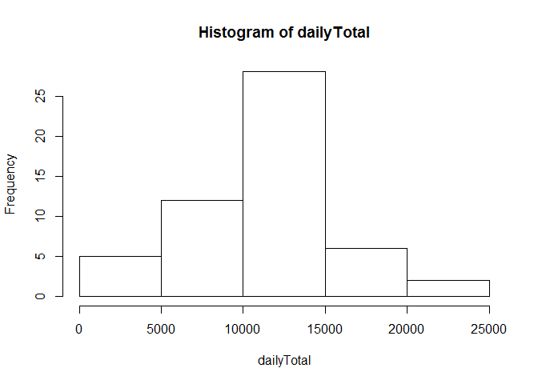
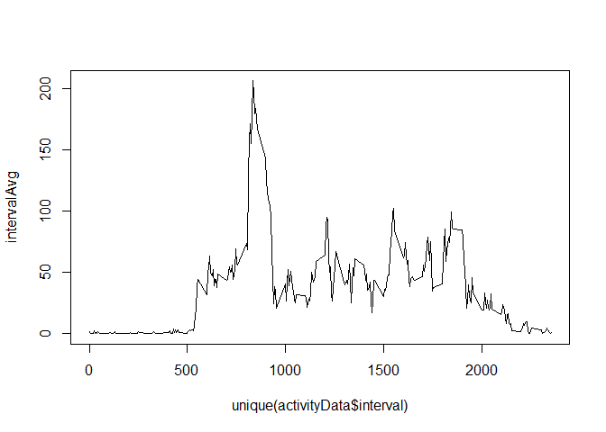
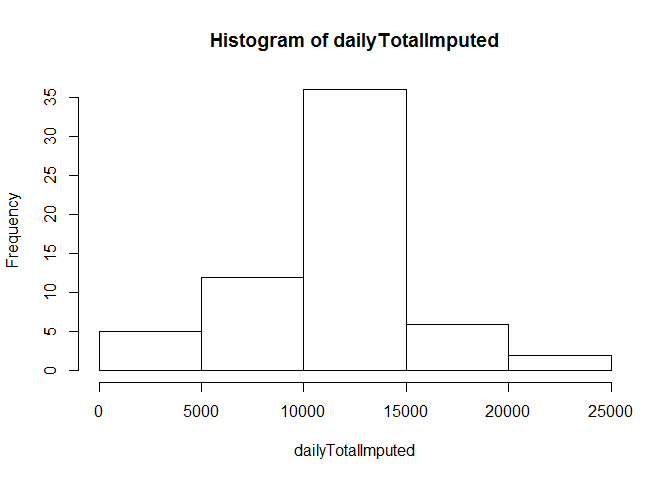
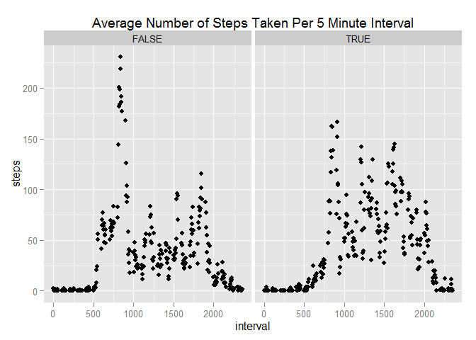

# Reproducible Research: Peer Assessment 1


## Loading and preprocessing the data
First, load the data into a data frame.

```r
activityData <- read.csv('C:/Users/cjpearce/Documents/Reproducible Research/repdata-data-activity/activity.csv')
```

Use the head and str functions to see the data types and what the data looks like.

```r
head(activityData)
```

```
##   steps       date interval
## 1    NA 2012-10-01        0
## 2    NA 2012-10-01        5
## 3    NA 2012-10-01       10
## 4    NA 2012-10-01       15
## 5    NA 2012-10-01       20
## 6    NA 2012-10-01       25
```

```r
str(activityData)
```

```
## 'data.frame':	17568 obs. of  3 variables:
##  $ steps   : int  NA NA NA NA NA NA NA NA NA NA ...
##  $ date    : Factor w/ 61 levels "2012-10-01","2012-10-02",..: 1 1 1 1 1 1 1 1 1 1 ...
##  $ interval: int  0 5 10 15 20 25 30 35 40 45 ...
```

Create a histogram to see how many steps are usually taken in a day.

```r
dailyTotal <- tapply(activityData$steps, activityData$date, sum)
hist(dailyTotal)
```

 


## What is mean total number of steps taken per day?
To find out what the mean total number of steps taken per day is, use the mean function, ignoring NA values.

```r
mean(dailyTotal, na.rm = TRUE)
```

```
## [1] 10766.19
```

```r
median(dailyTotal, na.rm = TRUE)
```

```
## [1] 10765
```


## What is the average daily activity pattern?

To see the average daily activity pattern, we will first get the average number of steps taken during each 5-minute interval:


```r
intervalAvg <- tapply(activityData$steps, activityData$interval, mean, na.rm = TRUE)
```

And then we will plot those averages:

```r
plot.ts(unique(activityData$interval), intervalAvg, type="l")
```

 

## Imputing missing values

In order to remove NA values, we will substitute each NA value for the average number of steps taken during that interval across all days.
To do that, we will use the data.table package

```r
library("data.table")
activityDataDT <- data.table(activityData)
```

First, we will calculate the average number of steps during each interval across all days.

```r
averageStepsByIntervalDT <- activityDataDT[, list(mean = mean(steps, na.rm=TRUE)), by=interval]
```

Then we will create a new data table that contains all of the data from the original activity data data set merged with the average number of steps for each interval.

```r
activityDataImputed <- merge(activityDataDT, averageStepsByIntervalDT, by="interval")
head(activityDataImputed)
```

```
##    interval steps       date     mean
## 1:        0    NA 2012-10-01 1.716981
## 2:        0     0 2012-10-02 1.716981
## 3:        0     0 2012-10-03 1.716981
## 4:        0    47 2012-10-04 1.716981
## 5:        0     0 2012-10-05 1.716981
## 6:        0     0 2012-10-06 1.716981
```

Then we will convert the column type of steps from int to num so that it can handle doubles.

```r
activityDataImputed$steps <- as.double(activityDataImputed$steps)
str(activityDataImputed)
```

```
## Classes 'data.table' and 'data.frame':	17568 obs. of  4 variables:
##  $ interval: int  0 0 0 0 0 0 0 0 0 0 ...
##  $ steps   : num  NA 0 0 47 0 0 0 NA 0 34 ...
##  $ date    : Factor w/ 61 levels "2012-10-01","2012-10-02",..: 1 2 3 4 5 6 7 8 9 10 ...
##  $ mean    : num  1.72 1.72 1.72 1.72 1.72 ...
##  - attr(*, ".internal.selfref")=<externalptr> 
##  - attr(*, "sorted")= chr "interval"
```

For each NA value, we will put in its place its corresponding average interval value.

```r
activityDataImputed[is.na(steps), steps := mean]
head(activityDataImputed)
```

```
##    interval     steps       date     mean
## 1:        0  1.716981 2012-10-01 1.716981
## 2:        0  0.000000 2012-10-02 1.716981
## 3:        0  0.000000 2012-10-03 1.716981
## 4:        0 47.000000 2012-10-04 1.716981
## 5:        0  0.000000 2012-10-05 1.716981
## 6:        0  0.000000 2012-10-06 1.716981
```

Then we will view the histogram 

```r
## Histogram of daily totals, with NA values replaced.
dailyTotalImputed <- tapply(activityDataImputed$steps, activityDataImputed$date, sum)
hist(dailyTotalImputed)
```

 

The new mean and median values. The mean value did not change, but the median value did. It makes sense that the average value did not change, as the values subsituted for the NA values were themselves averages of the whole set.

```r
mean(dailyTotalImputed, na.rm = TRUE)
```

```
## [1] 10766.19
```

```r
median(dailyTotalImputed, na.rm = TRUE)
```

```
## [1] 10766.19
```

## Are there differences in activity patterns between weekdays and weekends?
There do appear to be some differences in the activity patterns between weekdays and weekends. While the activity appears to begin and end around the same times on weekdays and weekends, the average number of steps taken throughout the day are different. On weekdays, there appear to be spikes around mid morning, noon, and the late evening. These could be explained by people commuting to and from work and taking a lunch break. On weekends, the average number of steps taken throughout the day is much mor even.


First, convert the type of the date column to Date.

```r
activityDataImputed$date <- as.Date(activityDataImputed$date)
weekendVector <- c("Saturday", "Sunday")
```


Then determine which rows correspond to weekends.

```r
isWeekday <- weekdays(activityDataImputed$date)
activityDataImputed$dayType <- as.factor(isWeekday %in% weekendVector)
```

Finally, plot the average number of steps taken per 5 minute interval. Weekdays on left, weekends on right.

```r
## Plot using the ggplot2 library.
library("ggplot2")
qplot(interval, steps, data = activityDataImputed, facets = . ~ dayType, stat="summary", fun.y = "mean", main = "Average Number of Steps Taken Per 5 Minute Interval", type="l")
```

 
